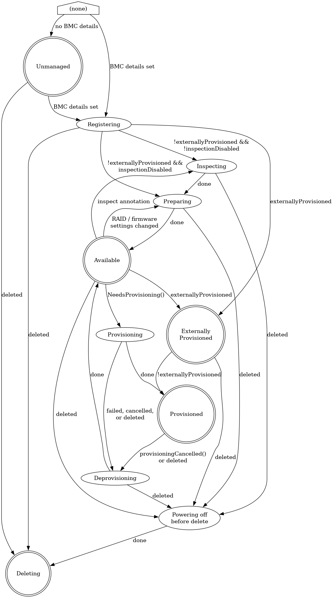

# BareMetalHost States

A BareMetalHost has two independent status fields:

- `status.provisioning.state` is the provisioning phase.
- `status.operationalStatus` is the overall health of the host.

Errors do not move the host into a separate provisioning state.
They set `status.operationalStatus` to `error` and populate
`status.errorType` and `status.errorMessage`.

The following diagram shows the provisioning state transitions:

The diagram is generated from
[`BaremetalHost_ProvisioningState.dot`](BaremetalHost_ProvisioningState.dot)
with `make docs`.

## Provisioning states

### None (created)

A newly created host has an empty provisioning state.
The operator immediately moves it to `registering` if BMC details are
present, or to `unmanaged` otherwise.
No host stays in this state while the operator is working properly.

### Unmanaged

An unmanaged host is missing both the BMC address and the credentials
secret name, so the operator cannot contact the BMC.
The operational status is `discovered` until BMC details are provided,
at which point the host moves to `registering`.

### Registering

The host stays in `registering` while BMC access details are validated.
After a successful registration:

- `spec.externallyProvisioned: true` moves to `externally provisioned`
- inspection disabled (`spec.inspectionMode: disabled` or the
  `inspect.metal3.io: disabled` annotation) moves to `preparing`
- otherwise the host moves to `inspecting`

Deleting a host in `registering` skips power-off and goes straight to
`deleting`.

### Inspecting

After registration, an agent image is booted on the host unless
`spec.inspectionMode` is `disabled` or `fast`.
`disabled` skips inspection and moves to `preparing`.
`fast` inspects out-of-band via the BMC without a ramdisk.
Otherwise the agent collects hardware inventory.
The host stays in `inspecting` until that process completes, then moves
to `preparing`.
Successful inspection creates a `HardwareData` resource.

Hosts in `available` can be sent back to `inspecting` with the
`inspect.metal3.io` annotation.
See [Inspect Annotation](inspectAnnotation.md).

### Preparing

RAID, BIOS, and similar configuration is applied in `preparing`.
For the Ironic provisioner this is implemented as manual clean steps.
When preparation completes, the host becomes `available`.

A host already in `available` returns to `preparing` when RAID, firmware
settings, or firmware component updates change.

### Available

A host in `available` can be provisioned.
In older versions this state was called `ready`; the operator still
accepts that value.

The host moves to `provisioning` when `NeedsProvisioning()` is true:
`spec.online` is true and either `spec.image.url` or
`spec.customDeploy` is set.
Setting `spec.externallyProvisioned: true` moves an available host to
`externally provisioned`.

### Provisioning

While an image is being written to the host, or a custom deploy step
is running, the host is in `provisioning`.
On success it becomes `provisioned`.
On failure, cancellation, or deletion it moves to `deprovisioning`.

### Provisioned

After the image is on the host, the host is in `provisioned`.
Clearing `spec.image` / `spec.customDeploy`, changing the image URL, or
deleting the host moves it to `deprovisioning`.

Live firmware updates on a provisioned host do not change the
provisioning state.
They set `operationalStatus` to `servicing`.
See the [live updates guide](https://book.metal3.io/bmo/live_updates_servicing).

### Externally provisioned

An externally provisioned host was deployed by another tool, or was
handed off after inspection by setting `spec.externallyProvisioned`.
The operator monitors the host and manages power, but does not
provision an image.

Clearing `spec.externallyProvisioned` moves the host to `provisioned`.
If no image or custom deploy is set, deprovisioning starts on the next
reconcile.

When using these hosts with Cluster API Provider Metal3 (CAPM3), label
them so CAPM3's host selector does not claim hosts managed by an
external provisioner.

### Deprovisioning

The previously provisioned image is being removed.
When deprovisioning completes without a deletion in progress, the host
returns to `available`.
It does not jump straight back to `provisioning`; a later reconcile
from `available` starts provisioning again if an image is still set.

If the host is being deleted, successful (or given-up) deprovisioning
moves to `powering off before delete`.

### Powering off before delete

Most non-provisioned hosts are powered off before the Kubernetes object
is removed.
Hosts in `registering`, `unmanaged`, or the empty created state skip
this step.
Hosts with the `baremetalhost.metal3.io/detached` annotation also skip
power-off and deprovisioning and go straight to `deleting`
(see [Operational status](#operational-status)).

### Deleting

The host record is being removed from Kubernetes, including Ironic
registration and owned resources such as `HardwareData`.

## Operational status

`status.operationalStatus` is independent of the provisioning state:

- `OK` — the host is healthy
- `discovered` — the host is known but lacks BMC details
- `error` — an operation failed; see `status.errorType` and
  `status.errorMessage`
- `delayed` — (de)provisioning or inspection is waiting because
  `PROVISIONING_LIMIT` is reached
- `detached` — the `baremetalhost.metal3.io/detached` annotation is
  set; the provisioner is not managing the host
- `servicing` — a live firmware update is in progress on a provisioned
  host

Typical `errorType` values include registration, inspection,
preparation, provisioning, power management, detach, and servicing
errors.
The host remains in its current provisioning state while the operator
retries.
