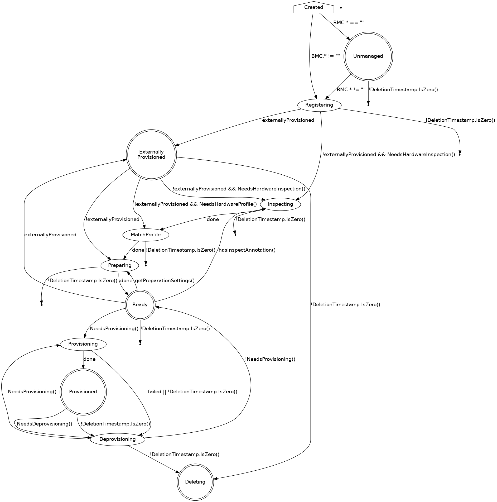

# BaremetalHost Provisioning States

The following diagram shows the possible Provisioning State transitions for the BaremetalHost object:

## Created

Newly created hosts move immediately to Discovered or Registering. No
host stays in the Created state while the operator is working
properly.

## Discovered

A Discovered host is missing either the BMC address or credentials
secret name, and does not have enough information to access the BMC
for registration.

## Externally Provisioned

An Externally Provisioned host was deployed using another tool and
then a host object was created with a link to an existing Machine
object and without an Image setting. Hosts in this state are
monitored, and only their power status is managed.

## Registering

The host will stay in the Registering state while the BMC access
details are being validated.

## Inspecting

After the host is registered, an agent image will be booted on it
using a ramdisk. The agent collects information about the available
hardware components, and this process is called "inspection." The host
will stay in the Inspecting state until this process is completed.

## Ready

A host in the Ready state is available to be provisioned.

## Provisioning

While an image is being copied to the host and it is being configured
to run the image the host will be in the Provisioning state.

## Provisioned

After an image is copied to the host and the host is running the
image, it will be in the Provisioned state.

## Deprovisioning

When the previously provisioned image is being removed from the host,
it will be in the Deprovisioning state.

## Error

If an error occurs during one of the processing states (Registering,
Inspecting, Provisioning, Deprovisioning) the host will enter the
Error state.

## Deleted

When the host is marked to be deleted, it will move from its current
state to Deleted, at which point the resource record is deleted from
kubernetes.
